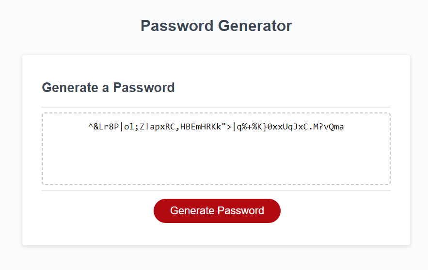

# JavaScript Password Generator
Generates random password based on selected criteria using JavaScript.

## Description
Presents series of promts for password criteria as follows:
- Prompts to enter the length of the password. The password length must be between 8 and 128 characters.
- Displays an error message indicating invalid input if entered value is either less than 8 or greater than 128 or non-numeric and asks to try again.
- Prompts to select lowercase, uppercase, numeric and/or special characters one by one. At least one character type must be selected.
- Displays an error message indicating no character type is selected if no character type is selected and asks to try again.
- Generates random secure password that matches the selected criteria.
- Displays the generated password in password text area. 

## Deployment
The webpage is deployed to GitHub pages. Use below link to visit the webpage: https://nileshpatel83.github.io/portfolio/

## Screenshot

## License
Please refer to the LICENSE in the repo.